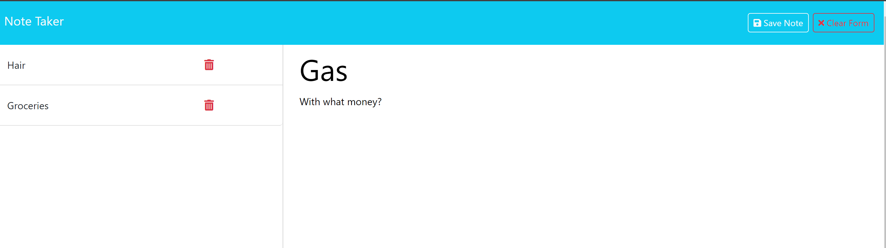

# Note-Taker

## Description
An application that can be used to write down my thoughts and save notes for tasks that I might need to complete.

## Installation
* Express 4.16.4
* UUID 9.0.1

## Usage
You will need to run this application in your Node terminal.
* Heroku link: https://note-taker-ch-2fccc6f24074.herokuapp.com/

## Screenshot

## License
MIT

## Contributing
N/A

## Repo Link

Github: https://github.com/JennaJay/Note-Taker

